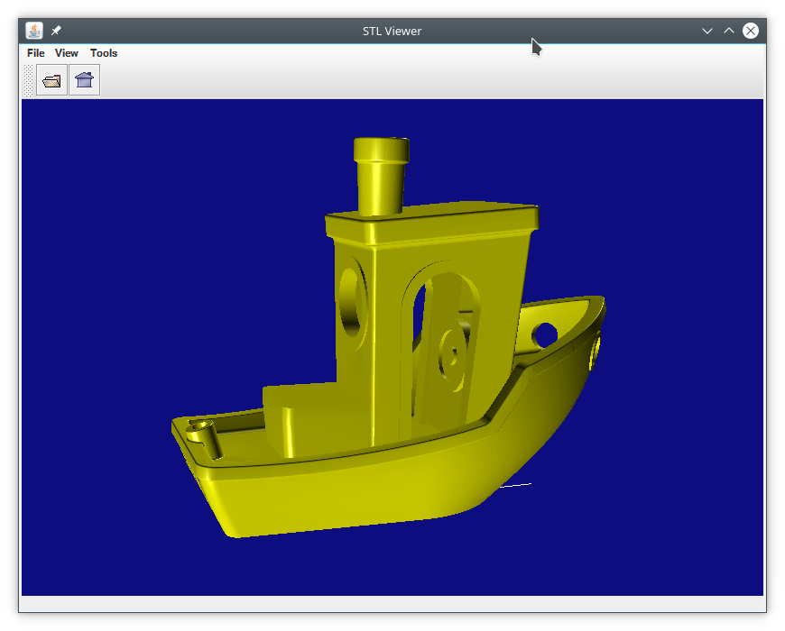

STLViewer
=========

[STL](http://en.wikipedia.org/wiki/STL_(file_format)) 3D object file viewer for java.

# install
unzip distributed stlviewer*.zip

should extract:
stlviewer.jar
libs/j3dcore.jar  
libs/j3dutils.jar  
libs/jogamp-fat.jar
libs/vecmath.jar
, etc to a directory

# run
java -jar stlviewer.jar
(the above libs jars should be in libs subdirectory)

- holding / dragging the left mouse button rotates the model
- holding / dragging the right mouse button pan the model
- rotating the mouse wheel forward moves away from the model / backward moves towards the model
- clicking home on the toolbar reverts to the initial view

# build

ant
(ant and jdk is required for the build')

# Pre-requisites

Java >= 1.8

# note
- the app resizes the model and relocates the origin to ease viewing manipulations

# Attributions
this app/project uses/is made possible by the java3d and jogl implementations maintained by the jogamp community
and part are derivatived works in particular of java3d from sun/oracle
- http://jogamp.org/
- https://gouessej.wordpress.com/2012/08/01/java-3d-est-de-retour-java-3d-is-back
- https://github.com/hharrison/java3d-core
- https://github.com/hharrison/java3d-utils
- https://github.com/hharrison/vecmath
- http://jogamp.org/deployment/v2.3.2/fat/jogamp-fat.jar

and the stl parser by cyanobacterium
https://github.com/cyanobacterium/STL-Parser-for-Java

partially derived from
cpedrinaci/STL-Loader https://github.com/cpedrinaci/STL-Loader

# Licence

[Apache License, Version 2.0](http://www.apache.org/licenses/LICENSE-2.0.html)
applies to code package org.stlviewer sub-branch

Software is distributed on an "AS IS" BASIS, WITHOUT WARRANTIES OR CONDITIONS OF ANY KIND, either express or implied.

# origin
originally hosted on: https://github.com/ag88/stl-viewer

developing this has taken quite some effort mainly in getting it to work and rather extensive tests. i'd really appreciate it if you could support my efforts  ;)